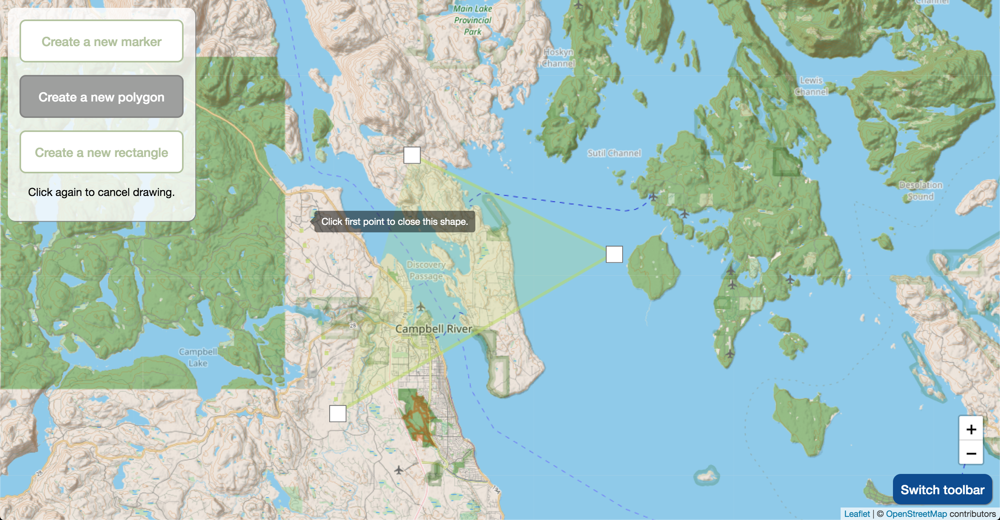
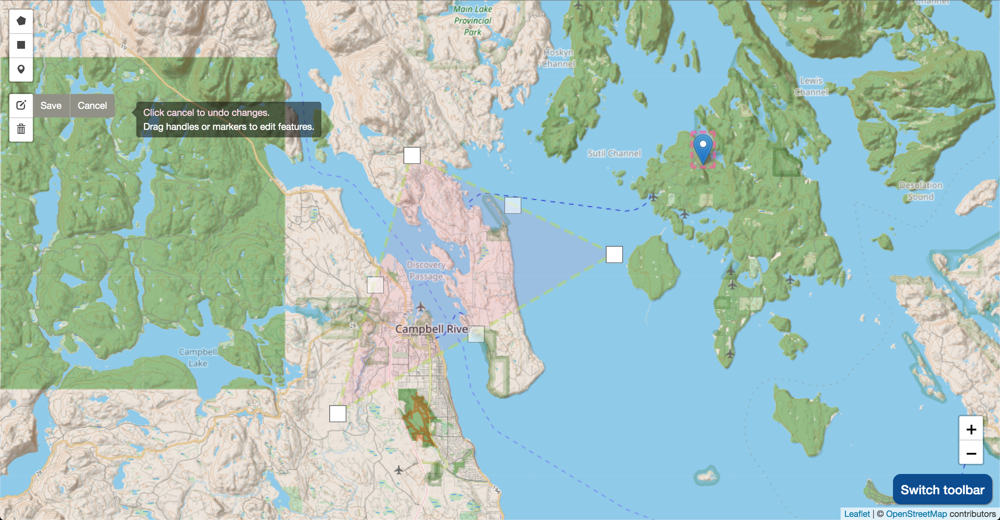

# Custom toolbar for drawing with Leaflet

This small frontend project attaches the  functionality of <a href="https://github.com/Leaflet/Leaflet.draw">Leaflet Draw</a> into a custom html/css toolbar. This draws users attention to the actions available on the page and provides more instruction for how to use the features than the default toolbar provided with Leaflet Draw. There is also a toggle button to swap between the simple 'draw or cancel' toolbar and more fully featured default toolbar (provides editing, deleting of shapes).

### Running

Download the project and open 'index.html' in a browser with an internet connection.

### At a glance

The custom toolbar appears on the landing page, directing users on page actions and how to start or cancel drawing.

The 'switch toolbar' button opens the default toolbar, which can be used to draw/edit/delete shapes. The toolbars can be used on the same shapes interchangeably.

